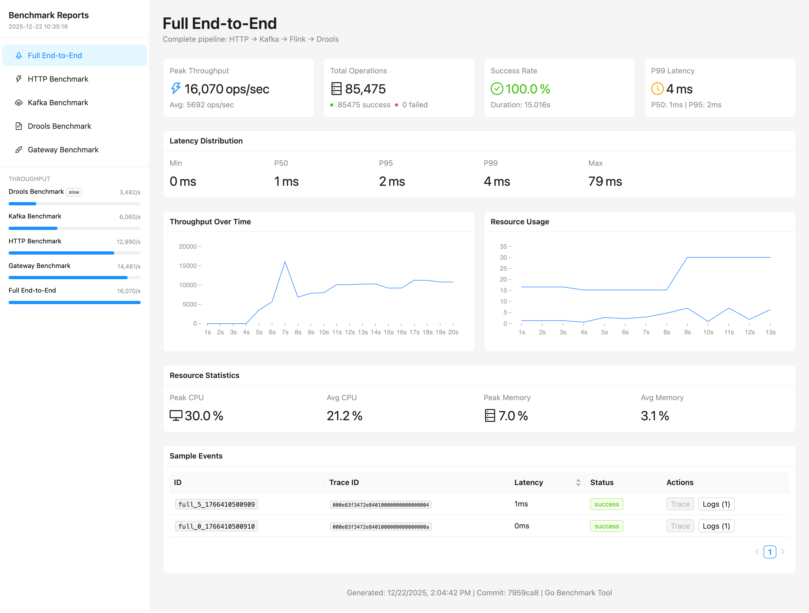

# Reactive System

A Docker-first microservices architecture demonstrating real-time stream processing with React, Kafka, Flink, and Drools.



## Beyond the Stack

This project is more than a technology demonstration. The emphasis is on **benchmarking methodology** and **observability infrastructure** as first-class concerns in system development.

Key principles applied:

- **Platform/Application separation** - Infrastructure concerns (Kafka, OTel, benchmarks) live in the platform layer; domain logic (Flink state machines, business rules) lives in the application layer. This enables fast compile cycles during domain development.
- **Component-level benchmarking** - Each layer (HTTP, Gateway, Kafka, Drools, full E2E) is benchmarked independently to identify bottlenecks directly rather than guessing from aggregate metrics.
- **Observability from day one** - Grafana dashboards, Loki log aggregation, Jaeger distributed tracing, and Prometheus metrics are integrated before optimization begins.
- **Continuous measurement** - Performance work is iterative. Each optimization shifts the bottleneck elsewhere. The benchmark infrastructure supports regression testing across changes.

For a detailed discussion of the system design choices and benchmarking approach, see [PRESENTATION.md](PRESENTATION.md).

## Architecture

```
┌─────────────┐    WebSocket    ┌─────────────────┐
│   React UI  │◄───────────────►│  Gateway (Node) │
│  (Counter)  │                 │                 │
└─────────────┘                 └────────┬────────┘
                                         │
                    ┌────────────────────┼────────────────────┐
                    │                    │                    │
                    ▼                    ▼                    ▼
              ┌──────────┐        ┌──────────┐        ┌──────────┐
              │  Kafka   │◄──────►│  Flink   │◄──────►│  Drools  │
              │          │        │          │        │          │
              └──────────┘        └──────────┘        └──────────┘
```

### Data Flow

1. User clicks increment/decrement in React UI
2. WebSocket sends event to Gateway
3. Gateway publishes to Kafka topic `counter-events`
4. Flink job consumes events, maintains state, calls Drools
5. Drools evaluates business rules
6. Flink publishes result to Kafka topic `counter-results`
7. Gateway consumes results, pushes via WebSocket to UI
8. UI displays updated counter with alert level

### Business Rules (Drools)

| Counter Value | Alert Level |
|--------------|-------------|
| 0 | RESET |
| 1-10 | NORMAL |
| 11-100 | WARNING |
| > 100 | CRITICAL |
| < 0 | INVALID |

## Quick Start

```bash
# Start all services
./cli.sh start

# Check health of all services
./cli.sh doctor

# Open UI in browser
open http://localhost:3000
```

## CLI Commands

```bash
./cli.sh start [service]      # Start all or specific service
./cli.sh stop [service]       # Stop all or specific service
./cli.sh restart [service]    # Restart all or specific service
./cli.sh build [service]      # Build Docker images
./cli.sh logs [service]       # View logs (follows)
./cli.sh status               # Show running services
./cli.sh shell <service>      # Enter container shell
./cli.sh doctor               # Health check all services
./cli.sh e2e                  # Run end-to-end test
./cli.sh compile drools       # Recompile Drools rules
./cli.sh up                   # Alias for 'start'
./cli.sh down                 # Stop and remove all containers
./cli.sh help                 # Show help message
```

### Examples

```bash
# Start only the UI
./cli.sh start ui

# View Flink logs
./cli.sh logs flink

# Restart the gateway
./cli.sh restart gateway

# Enter Kafka container shell
./cli.sh shell kafka

# Run end-to-end tests
./cli.sh e2e
```

## Services

| Service | Port | Description |
|---------|------|-------------|
| UI | 3000 | React frontend |
| Gateway | 8080 | WebSocket/REST API bridge |
| Flink Dashboard | 8081 | Flink web interface |
| Drools | 8180 | Business rules engine |
| Kafka | 9092 | Message broker |
| Zookeeper | 2181 | Kafka coordination |

## Project Structure

```
reactive-system-01/
├── cli.sh                    # Main CLI
├── docker-compose.yml        # Production stack
├── docker-compose.dev.yml    # Development overrides
├── .env                      # Environment variables
│
├── ui/                       # React Frontend
│   ├── Dockerfile
│   ├── src/
│   │   ├── App.tsx
│   │   ├── components/
│   │   │   ├── Counter.tsx
│   │   │   └── ConnectionStatus.tsx
│   │   └── hooks/
│   │       └── useWebSocket.ts
│   └── vite.config.ts
│
├── gateway/                  # WebSocket Gateway
│   ├── Dockerfile
│   └── src/
│       ├── index.ts
│       ├── kafka.ts
│       └── websocket.ts
│
├── flink/                    # Stream Processing
│   ├── Dockerfile
│   ├── pom.xml
│   └── src/main/java/
│       └── com/reactive/flink/
│           ├── CounterJob.java
│           ├── model/
│           ├── processor/
│           └── serialization/
│
├── drools/                   # Business Rules
│   ├── Dockerfile
│   ├── pom.xml
│   └── src/main/
│       ├── java/com/reactive/drools/
│       └── resources/rules/
│           └── counter-rules.drl
│
└── scripts/                  # CLI helpers
    ├── utils.sh
    ├── doctor.sh
    └── e2e-test.sh
```

## Development

### Hot Reload Mode

For development with hot reload:

```bash
docker compose -f docker-compose.yml -f docker-compose.dev.yml up
```

This enables:
- UI: Vite dev server with HMR
- Gateway: ts-node-dev with auto-restart
- Drools: Mounted rules directory

### Modifying Business Rules

1. Edit `drools/src/main/resources/rules/counter-rules.drl`
2. Run `./cli.sh compile drools` or restart the drools service

### Adding New Kafka Topics

Topics are auto-created, but for explicit creation:

```bash
./cli.sh shell kafka
kafka-topics --create --topic my-topic --bootstrap-server localhost:9092
```

## API Reference

### Gateway REST API

#### POST /api/counter
Send a counter action.

```bash
curl -X POST http://localhost:8080/api/counter \
  -H "Content-Type: application/json" \
  -d '{"action": "increment", "value": 1}'
```

Actions: `increment`, `decrement`, `set`

#### GET /api/counter/status
Get current counter state.

```bash
curl http://localhost:8080/api/counter/status
```

#### GET /health
Health check endpoint.

```bash
curl http://localhost:8080/health
```

### WebSocket API

Connect to `ws://localhost:8080/ws`

#### Messages from Client

```json
{"type": "counter-action", "action": "increment", "value": 1}
{"type": "counter-action", "action": "set", "value": 50}
{"type": "ping"}
```

#### Messages from Server

```json
{"type": "connected", "sessionId": "uuid", "clientId": "uuid"}
{"type": "counter-update", "data": {"currentValue": 10, "alert": "NORMAL"}}
{"type": "pong", "timestamp": 1234567890}
```

### Drools REST API

#### POST /api/evaluate
Evaluate rules for a counter value.

```bash
curl -X POST http://localhost:8180/api/evaluate \
  -H "Content-Type: application/json" \
  -d '{"value": 50}'
```

Response:
```json
{
  "value": 50,
  "alert": "WARNING",
  "message": "Counter value is elevated",
  "timestamp": 1234567890
}
```

## Technology Stack

| Technology | Version | Purpose |
|------------|---------|---------|
| React | 18.x | Frontend UI |
| Vite | 5.x | Build tool |
| Node.js | 20 LTS | Gateway runtime |
| Apache Flink | 1.18.x | Stream processing |
| Apache Kafka | 3.6.x | Message broker |
| Drools | 8.x | Business rules |
| Java | 17 | JVM services |
| Docker Compose | v2 | Orchestration |

## Troubleshooting

### Services not starting

```bash
# Check Docker is running
docker info

# View all logs
./cli.sh logs

# Check specific service
./cli.sh logs kafka
```

### Kafka connection issues

Kafka may take up to 30 seconds to become ready. Run:

```bash
./cli.sh doctor
```

### Flink job not running

Check if the job was submitted:

```bash
# Open Flink dashboard
open http://localhost:8081

# Or check logs
./cli.sh logs flink
```

### WebSocket not connecting

Ensure the gateway is healthy:

```bash
curl http://localhost:8080/health
```

## License

MIT
